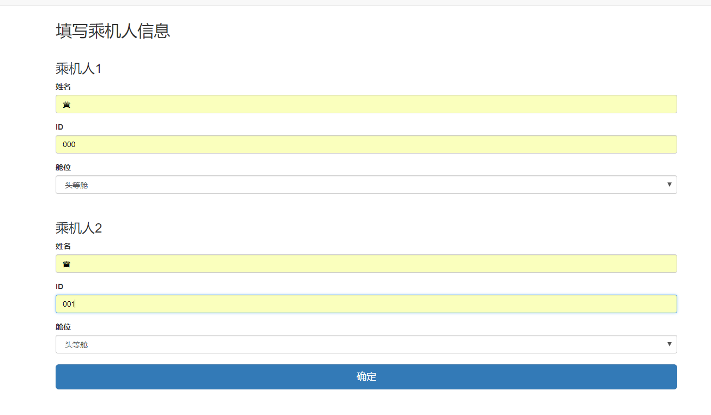

# 数据库设计与应用开发大作业
**项目名称：机票在线预订系统**  
16337098 黄义凯  
16337114 雷至祺  
16337264 徐骕伟  


## 一. 系统调查与分析
&emsp;&emsp;目前在市场上涌现出了大量出行旅游产品，它们功能齐全，无所不包，兼具机票、火车票、汽车票、景区门票等预订功能。然而，专注于航班查询、机票预订的产品目前在市面上仍比较少，因此我们设计了这样一个系统，致力于打造最专业的机票预订系统。  
&emsp;&emsp;在该系统中，使用者可在系统中注册一个用户，用该用户登录系统进行操作。主要功能如下：  
&emsp;&emsp;（1）查询航班信息  
&emsp;&emsp;（2）预订机票，生成订单  
&emsp;&emsp;（3）查询订单信息  
&emsp;&emsp;（4）支付订单  
&emsp;&emsp;（5）取消订单，即机票的退票  


## 二. 系统设计
&emsp;&emsp;


* 进入机票在线预订系统，首先进行注册，注册后登录。  
* 当前有两个主要功能，一是查询航班、二是查询订单。  
* 进入查询航班部分，根据用户输入的出发地、目的地、出行时间进行筛选，列出符合要求的航班信息，用户根据需要选择合适的航班预订，填写机票预订的数量以及相对应的乘机人信息，点击确认预订成功。  
* 返回主页面，进入查询订单部分，查看自己预订的订单信息，可以选择支付订单成功下单，也可以取消订单，还可以查询订单中所有的机票的具体信息。  


## 三. 数据库设计
### 1. 数据库概念结构设计
&emsp;&emsp;根据系统需求分析与设计来进行后端数据库的概念设计。  
&emsp;&emsp;我们设计了乘机人persons、系统用户users、机票信息tickets、订单信息orders、机型models、航班flights、机场airports、航空公司airlines、城市cities、系统管理员admins共10个实体集，并根据需求逻辑为实体集之间建立一对多和多对多联系。如下图：
&emsp;&emsp;


### 2. 数据库逻辑结构设计

&emsp;&emsp;将概念设计中的10个实体以及1个多对多联系转化为关系，其中persons和users间的多对多联系命名为manages，意为每一个用户管理一些乘机人的信息。  
&emsp;&emsp;为各个关系设计对应的属性，确定主码和外码，其中flights和airports间的“外码”约束指的是flights的起飞机场和降落机场须在airports内，图中用虚线表示。  
&emsp;&emsp;数据库逻辑结构设计如下图：  
&emsp;&emsp;


### 3. 数据库物理结构设计

&emsp;&emsp;为所有外键引用设计索引，并根据需求，对一些外键引用设计级联更新与删除。  
&emsp;&emsp;在PowerDesigner中绘制物理数据模型如下图：
&emsp;&emsp;


## 四.	数据库创建与数据加载

### 1. 数据库创建
&emsp;&emsp;用PowerDesigner自动生成数据库定义语句，根据设计创建索引，修改外键的更新与删除选项，并为某些table中的某些属性设置默认值。  

&emsp;&emsp;根据系统需求，建立存储过程、视图与触发器：  
#### （1）创建新订单的存储过程：  
&emsp;&emsp;创建新订单时，新订单号自增，并设置订单状态为"Processing"，即"处理中"，等待由flights出票。
```sql
delimiter //
create procedure Proc_new_order(in cur_user_name varchar(20), out cur_ord_id int)
begin
start transaction;
    set cur_ord_id = (select max(order_id) from orders);
	if cur_ord_id is null
    then set cur_ord_id = 1;
    end if;
    select cur_ord_id;
    set cur_ord_id = cur_ord_id + 1;
    insert into orders(order_id, user_name, order_time, status)
	values(cur_ord_id, cur_user_name, now(), 'Processing');
commit;
end;
//
delimiter ;
```
#### （2）航班信息的视图：  
&emsp;&emsp;将flights、airlines、airports连接后获取航班的详细信息。
```sql
create view V_flight_info(dept_city, dest_city, airline_name, flight_id, model_id, dept_airport, dept_datetime, dest_airport, dest_datetime, first_left, business_left, economy_left)
as
select DEP.city_name, DEST.city_name, airline_name, flight_id, model_id, DEP.airport_name, takeoff_time, DEST.airport_name, landing_time, first_left, business_left, economy_left
from flights F, airports DEP, airports DEST, airlines AL
where F.airline_id = AL.airline_id and F.departure_id = DEP.airport_id and F.destination_id = DEST.airport_id;
```
#### （3）订单信息的视图：  
&emsp;&emsp;将flights、tickets、persons、orders、airports连接后获取订单的详细信息。
```sql
create view V_order_info(order_id,person_name, ticket_id, flight_id, flight_date, class, dept_airport, dest_airport)
as
select T.order_id, P.name, T.ticket_id, T.flight_id, F.takeoff_time, T.class, DEP.airport_name, DEST.airport_name
from flights F, tickets T, persons P, Orders O, airports DEP, airports DEST
where F.flight_id = T.flight_id and T.order_id = O.order_id and T.person_id = P.person_id and F.departure_id = DEP.airport_id and F.destination_id = DEST.airport_id and T.takeoff_time = F.takeoff_time;
```
#### （4）航班起降地在机场表的触发器 以及 航班初始座位数与执飞机型座位数的触发器：   
&emsp;&emsp;在创建、更新航班前，检查航班设置的起飞机场和降落机场是否合法。  
&emsp;&emsp;航班在创建时，根据其执飞机型各舱位的座位总数来初始化各舱位的座位剩余数。  
&emsp;&emsp;当机场删除时，涉及的航班进行级联删除。
```sql
create trigger Tri_flights_airport_insert before insert on flights
for each row
begin
    if new.departure_id not in (select airport_id
								from airports)
	then
		signal sqlstate '88888' set message_text = 'Invalid departure airport';
	end if;
	if new.destination_id not in (select airport_id
								  from airports)
	then
		signal sqlstate '88889' set message_text = 'Invalid destination airport';
	end if;
    
    select first_total, business_total, economy_total into @f, @b, @e
    from models
    where new.model_id = models.model_id;
    
    set new.first_left = @f;
    set new.business_left = @b;
    set new.economy_left = @e;
end;
```

```sql
create trigger Tri_flights_airport_update before update on flights
for each row
begin
    if new.departure_id not in (select airport_id
								from airports)
	then
		signal sqlstate '88888' set message_text = 'Invalid departure airport';
	end if;
	if new.destination_id not in (select airport_id
								  from airports)
	then
		signal sqlstate '88889' set message_text = 'Invalid destination airport';
	end if;
end;
```

```sql
create trigger Tri_airports_delete before delete on airports
for each row
begin
    delete from flights
    where departure_id = old.airport_id or destination_id = old.airport_id;
end;
```

#### （5）机票变化引起航班剩余座位数变化的触发器：  
&emsp;&emsp;创建机票时，航班对应舱位的剩余座位数减一；删除机票时，航班对应舱位的剩余座位数加一。
```sql
create trigger Tri_tickets_delete before delete on tickets
for each row
begin
    update orders
    set status = 'Invalid'
    where orders.order_id = old.order_id;
    
    if old.class = '头等舱' then
        update flights
        set first_left = first_left + 1
        where old.flight_id = flights.flight_id and old.takeoff_time = flights.takeoff_time;    
    elseif old.class = '商务舱' then
        update flights
        set business_left = business_left + 1
        where old.flight_id = flights.flight_id and old.takeoff_time = flights.takeoff_time;
    elseif old.class = '经济舱' then
        update flights
        set economy_left = economy_left + 1
        where old.flight_id = flights.flight_id and old.takeoff_time = flights.takeoff_time;
    end if;
end;
```

```sql
create trigger Tri_tickets_insert before insert on tickets
for each row
begin
    if new.class = '头等舱' then
        update flights
        set first_left = first_left - 1
        where new.flight_id = flights.flight_id and new.takeoff_time = flights.takeoff_time;    
    elseif new.class = '商务舱' then
        update flights
        set business_left = business_left - 1
        where new.flight_id = flights.flight_id and new.takeoff_time = flights.takeoff_time;
    elseif new.class = '经济舱' then
        update flights
        set economy_left = economy_left - 1
        where new.flight_id = flights.flight_id and new.takeoff_time = flights.takeoff_time;
    end if;
end;
```

&emsp;&emsp;执行这些sql语句后，数据库成功创建。  


### 2. 数据加载

&emsp;&emsp;我们生成数据的主要目的是验证系统的正确性，因此：  

&emsp;&emsp;（1）对数据规模的要求不大。  

&emsp;&emsp;（2）数据要有较好的可读性，易于验证。  

&emsp;&emsp;（3）数据接近现实生活。  

&emsp;&emsp;为了满足上述要求，我们采用了自己写程序生成随机数据的方式：硬编码加上随机组合。  

&emsp;&emsp;事实上，需要提前导入数据的关系只有 airlines 、models 、cities 、 airports 、 flights 、 persons ，剩下的关系 users 、 manages 、 orders 、 tickets 的数据是用户产生的。  

&emsp;&emsp;比如要生成关系 airlines 的数据，用下面的 Python代码：  

```python
airlines = [
    ('CA', '中国国际航空'),
    ('CZ', '中国南方航空'),
    ('MU', '中国东方航空'),
]

for airline in airlines:
    text = "INSERT INTO airlines VALUES('{}', '{}');".format(
            airline[0], airline[1])
    fout.write(text)
    fout.write('\n')
```


&emsp;&emsp;得到的文件是 data.sql 文件，里面有若干条 `INSERT` 语句。创建好数据库之后使用 `SOURCE` 命令就能导入数据了。  


## 五.	数据库应用软件的功能设计和开发

### 1. 连接数据库

&emsp;&emsp;我们用 Python的 Django 框架开发了 Web 应用。 Django 框架支持 MySQL 5.6 及更高的版本。  

&emsp;&emsp;MySQL 有多个存储引擎，默认的是 InnoDB 。 InnoDB 对外键约束和事务有很好的支持。如果没有特殊的原因，无需显式配置存储引擎。  

&emsp;&emsp;MySQL 为 Python 提供的数据库驱动主要有两个： mysqlclient 和 MySQL Connector/Python ，这两个都可以在 Django 框架中使用。除了数据库驱动， Django 还需要适配器。 Django 已经为 mysqlclient 提供了适配器，而 MySQL Connector/Python 自己包含了适配器，所以不需要使用者手动配置。  

&emsp;&emsp;连接数据库的各项参数在 settings.py 文件中设置。我们的参数设置为  

```python
DATABASES = {
    'default': {
        'ENGINE': 'django.db.backends.mysql', # 使用 MySQL 数据库
        'OPTIONS': {
            'isolation_level': 'read committed' # Django 推荐使用的事务隔离性级别是已提交读
        },
        # 数据库的各项参数
        'NAME': 'bookdb',
        'USER': 'bookadmin',
        'PASSWORD': '123456',
        'HOST': '127.0.0.1',
        'PORT': '3306'
    }
}
```


### 2. 操作数据库

&emsp;&emsp;考虑到这是数据库课程的大作业，我们没有使用 Django 框架提供的抽象程度较高的 model layer ，而是使用 SQL 语句操作数据库。  

&emsp;&emsp;`django.db.connection` 对象提供与默认数据库的连接，调用 `connection.cursor()` 函数获得游标对象，随后调用 `cursor.execute(sql, [params])` 函数执行 SQL 语句。用 `cursor.fetchone()` 或 `cursor.fetchall()` 函数获得返回的行。  

&emsp;&emsp;比如我们要获得关系 users 的所有元组，可以使用下面的 Python 代码。  

```python
from django.db import connection
from collections import namedtuple

def namedtuple_fetchall(cursor):
    '''以namedtuple的形式返回cursor的查询结果'''
    desc = cursor.description
    nt_result = namedtuple('Result', [col[0] for col in desc])
    return [nt_result(*row) for row in cursor.fetchall()]

with connection.cursor() as cursor:
    cursor.execute("SELECT * FROM users", [])
    result = namedtuple_fetchall(cursor)
```


## 六.	数据库应用系统测试

### 1. 注册

* 填写用户名、密码、再次确认秘密、姓名、身份证号信息，进行注册。

&emsp;&emsp;

### 2. 登录

* 输入用户名、密码进行登录。

&emsp;&emsp;

### 3. 主界面

* 登录成功，显示登录主页面，下面分别有两个主要功能，左下角是查询航班，可以查阅具体的出行信息，右下角是查阅订单，可以得到当前用户所下的订单详情，支付订单和取消订单。下面点击查询航班按钮跳转。

&emsp;&emsp;

### 4. 查询航班界面

* 进入查询界面，可以根据自己的需要输入特定的信息进行查询。

&emsp;&emsp;

### 5. 查询特定的航班

* 比如指定从广州出发，到上海，2019.1.1日期的航班信息。

&emsp;&emsp;

### 6. 显示查询的航班信息

* 航班信息包括航班号、机型、出发地、起飞时间、到达地、落地时间，还有三种类型的座位以及剩余的座位数，选择第一条进行预订。

&emsp;&emsp;

### 7. 下定订票数目

* 预订票数指定为2。

&emsp;&emsp;

### 8. 填写乘机人信息

* 填写乘机人的姓名、ID、以及舱位类型选择，此时两位都是选择头等舱。

&emsp;&emsp;

### 9. 再次查询航班

* 预订成功后，再次查询对应的航班，可以看到刚刚预订的航班的头等舱数减少2，其他舱位数没有变化。

&emsp;&emsp;

### 10. 查询订单

* 此时从主页面点击右下角的查询订单，进入订单主页，可以看到下方有Tian用户预订订单的记录，显示记录的时间和状态，此时状态是processing，处理中，点击详情，查看机票具体信息。

&emsp;&emsp;

### 11. 机票详情

* 可以看到刚刚预订两位乘机人的乘机信息，航班号，起飞日期、舱位类别、出发地和目的地，点击buy支付订单。

&emsp;&emsp;

### 12. 再次查询订单状态

* 支付成功后更新订单，此时订单状态显示为valid，已经成功支付。

&emsp;&emsp;

### 13. 取消订单

* 在订单中，点击取消订单，此时再次查看订单，订单已经不存在。

&emsp;&emsp;

### 14. 再次查询航班

* 再次查询航班信息，先前预订的航班的头等舱座位已经恢复到20，说明系统保持一致性操作。

&emsp;&emsp;


## 七.	分析设计与实验总结
&emsp;&emsp;目前该系统的开发仍处于初级阶段，未来将做如下完善与改进：  
&emsp;&emsp;1. 利用好数据库设计中的cities实体来完善各个城市的信息；  
&emsp;&emsp;2. 利用好数据库设计中的manages实体来实现用户管理乘机人的信息；  
&emsp;&emsp;3. 利用好数据库设计中的admins实体，为各个航空公司提供管理员接口对航班信息进行修改等。

